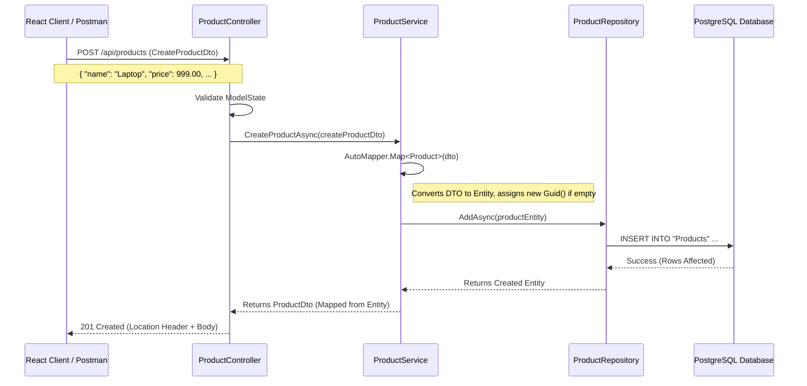
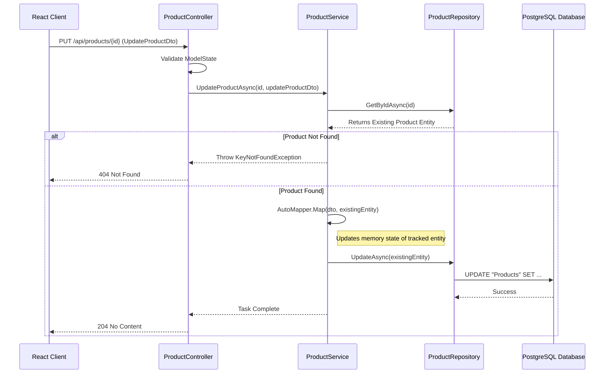
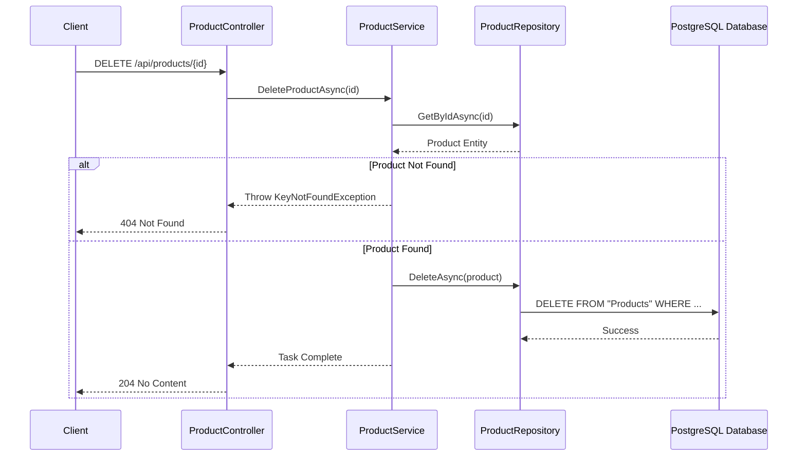

# Application Workflow Diagrams

This document outlines the data flow and class interactions for the core Create, Update, and Delete operations in the Product Application.

## 1. Insert Operation (Create Product)

### Sequence Diagram



### Data Flow Snapshot (Wireframe)

**1. Client Request (Payload)**
```json
{
  "name": "Gaming Laptop",
  "description": "High performance laptop",
  "price": 1499.99,
  "stock": 50,
  "isActive": true
}
```

**2. Controller Layer (`ProductController`)**
*   **Input**: `CreateProductDto` (Model Bound from JSON)
*   **Action**: `Create(createProductDto)`
*   **Validation**: Checks if Name is required, Price > 0, etc.

**3. Service Layer (`ProductService`)**
*   **Input**: `CreateProductDto` object.
*   **Processing**:
    *   Maps `CreateProductDto` -> `Product` entity.
    *   `Product` entity state:
        ```csharp
        Id: 00000000-0000-0000-0000-000000000000 // Initially
        Name: "Gaming Laptop"
        Price: 1499.99
        ...
        ```
    *   Sets `Id = Guid.NewGuid()` (if not auto-generated by DB context logic) and `CreatedAt`.
*   **Call**: `_productRepository.AddAsync(product)`

**4. Repository Layer (`ProductRepository`)**
*   **Input**: `Product` entity (ready for insertion).
*   **Action**:
    *   `_context.Products.AddAsync(product)` (Tracks entity state as `Added`)
    *   `_context.SaveChangesAsync()` (Executes SQL INSERT)
*   **SQL generated**:
    ```sql
    INSERT INTO "Products" ("Id", "Name", "Description", "Price", "Stock", "IsActive", "CreatedAt")
    VALUES ('a1b2c3d4-...', 'Gaming Laptop', 'High performance laptop', 1499.99, 50, true, '2023-10-27...');
    ```

**5. Response**
*   **Output**: `201 Created`
*   **Body**:
    ```json
    {
        "id": "a1b2c3d4-e5f6-7890-1234-567890abcdef",
        "name": "Gaming Laptop",
        "description": "High performance laptop",
        "price": 1499.99,
        "stock": 50,
        "isActive": true
    }
    ```

---

## 2. Update Operation (Edit Product)

### Sequence Diagram



### Data Flow Snapshot (Wireframe)

**1. Client Request (Payload)**
*   **URL**: `PUT /api/products/a1b2c3d4-e5f6-7890-1234-567890abcdef`
*   **Body**:
    ```json
    {
      "name": "Gaming Laptop Pro",
      "description": "Updated description",
      "price": 1399.99,
      "stock": 45,
      "isActive": true
    }
    ```

**2. Controller Layer (`ProductController`)**
*   **Input**: `Guid id`, `UpdateProductDto`
*   **Action**: `Update(id, updateProductDto)`

**3. Service Layer (`ProductService`)**
*   **Step 1: Fetch**: Calls `_productRepository.GetByIdAsync(id)` to ensure it exists.
    *   *Result*: `Product` entity (Tracked by EF Core).
*   **Step 2: Map**: `_mapper.Map(updateProductDto, existingProduct)`
    *   *Before Map*: `Name = "Gaming Laptop"`
    *   *After Map*: `Name = "Gaming Laptop Pro"` (Entity state marks properties as Modified).
*   **Step 3: Save**: `_productRepository.UpdateAsync(existingProduct)`

**4. Repository Layer (`ProductRepository`)**
*   **Action**:
    *   `_context.Products.Update(product)` (Forces state to Modified, though change tracking usually handles this automatically if fetched from same context).
    *   `_context.SaveChangesAsync()`
*   **SQL generated**:
    ```sql
    UPDATE "Products"
    SET "Name" = 'Gaming Laptop Pro', "Price" = 1399.99, ...
    WHERE "Id" = 'a1b2c3d4-...';
    ```

**5. Response**
*   **Output**: `204 No Content` (Standard for PUT updates implies success without returning a body).

---

## 3. Delete Operation (Remove Product)

### Sequence Diagram



### Data Flow Snapshot (Wireframe)

**1. Client Request**
*   **URL**: `DELETE /api/products/a1b2c3d4-e5f6-7890-1234-567890abcdef`

**2. Controller Layer (`ProductController`)**
*   **Action**: `Delete(id)`

**3. Service Layer (`ProductService`)**
*   **Step 1**: `_productRepository.GetByIdAsync(id)` retrieves the entity.
*   **Step 2**: `_productRepository.DeleteAsync(product)` passing the entity.

**4. Repository Layer (`ProductRepository`)**
*   **Action**:
    *   `_context.Products.Remove(product)` (Sets entity state to `Deleted`).
    *   `_context.SaveChangesAsync()`
*   **SQL generated**:
    ```sql
    DELETE FROM "Products"
    WHERE "Id" = 'a1b2c3d4-e5f6-7890-1234-567890abcdef';
    ```

**5. Response**
*   **Output**: `204 No Content`
